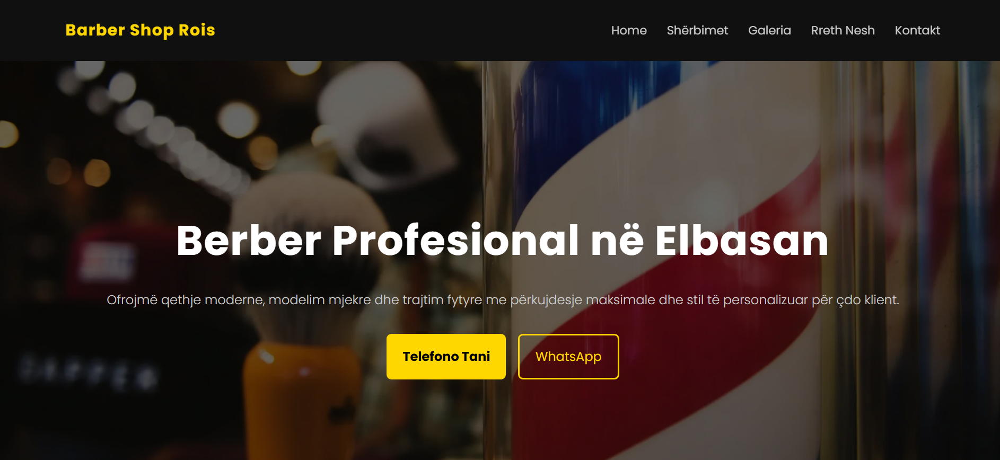

# Barber Shop Website – Elbasan

```md
## Preview


```

## Overview

This project is a modern, responsive promotional website developed for a local barber shop in Elbasan, Albania.

The goal of this project was to create a clean, dark-themed, professional online presence to improve local visibility, 
showcase services, and integrate direct customer contact via WhatsApp and Google Maps.

The website was built using React and deployed to production using Vercel.

## Project Scope

This project was designed and implemented entirely by me as a real-world client project.

It includes:

- UI/UX design decisions
- Responsive layout implementation
- Image optimization
- Performance improvements
- SEO optimization
- Deployment and production testing

## Features

- Responsive dark modern design
- Sticky navigation with smooth scrolling
- Hero section with call-to-action
- Services section with icons
- Gallery layout using CSS Grid
- Featured 2x2 image layout on desktop
- WhatsApp contact button with pre-filled message
- Direct phone call link
- Google Maps integration
- Fully responsive footer layout
- Optimized WebP images
- Lighthouse-tested performance

## Frontend Implementation

- Component-based architecture using React
- Built with Vite for fast development and optimized builds
- CSS Grid for gallery layout
- Flexbox for header and footer alignment
- Mobile-first responsive strategy
- Media queries for breakpoint management
- Lazy loading for gallery images
- Optimized image assets (WebP format)
- Production deployment with Vercel

## Architecture

- Frontend: React + Vite
- Styling: Custom CSS (Flexbox & Grid)
- Deployment: Vercel
- Optimization: Lighthouse testing
- SEO: Structured headings, meta tags, optimized images


## Tech Stack

- React
- Vite
- JavaScript (ES Modules)
- CSS3 (Flexbox & Grid)
- Responsive Design (Media Queries)
- Vercel (Deployment)


## Live Demo

- Website: https://barber-website-elbasan.vercel.app/

## Run Locally

```bash
git clone https://github.com/d00055a/barber-website-elbasan.git
cd barber-website-elbasan
npm install
npm run dev
```

To build for production:

```bash
npm run build
```

## Performance & Optimization

Lighthouse Results:

- Performance: 90 (Mobile) / 99 (Desktop)
- Accessibility: 100
- Best Practices: 100
- SEO: 100

Optimizations implemented:

- Image compression (WebP format)
- Lazy loading for non-critical images
- Optimized layout shifts
- Production build optimization via Vite


## Responsive Strategy

Breakpoints used:

- Mobile: default layout (single column)
- Tablet: 768px+
- Desktop: 1024px+

Gallery layout adapts dynamically using CSS Grid, with a featured image spanning two rows and two columns on larger screens.

## Purpose

This project was built to demonstrate:

- Real-world responsive web development
- Layout management with CSS Grid and Flexbox
- Performance optimization techniques
- Client-based project workflow
- Production deployment
- Practical SEO implementation
- Debugging responsive edge cases

## What I Learned

This project was built to demonstrate:

- Handling CSS Grid row spanning correctly using grid-auto-rows
- Managing layout conflicts between fixed heights and responsive design
- Breakpoint strategy refinement
- Debugging layout issues across multiple screen sizes
- Structuring real client projects professionally
- Writing clean commit history and project documentation

## License

This project was built for a local business. Code structure and layout can be reused for portfolio and educational purposes.
